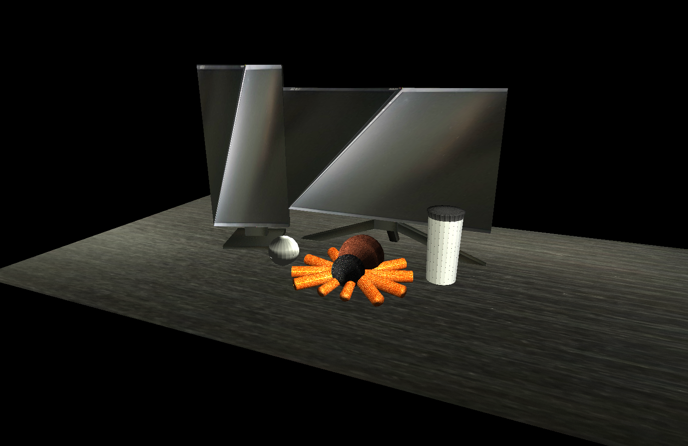
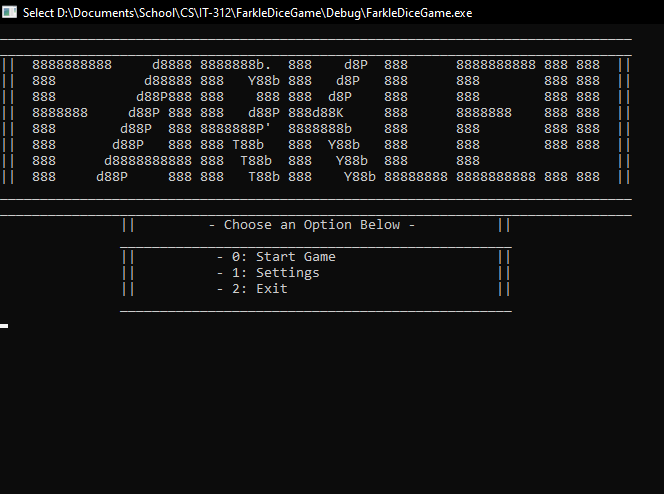
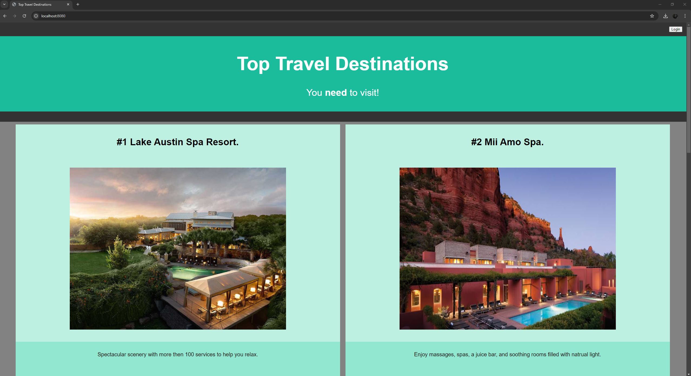

<h1 align="center"> Introduction </h1>

Hello, my name is Dylan Kimball and this is an ePortfolio showcasing my work and projects created during my time in SNHU's Computer Science program. I started this program nearly 3 years ago and have created multiple projects during that time. In the ePortfolio I have selected three previous projects I have created and enhanced them to bring improved functionality, efficiency, and formatting. These enhancements showcase the skills I have gained and knowledge I have learned during my time in the Computer Science program.

<!-- // PROFESSIONAL SELF-ASSESSMENT SECTION // -->
<h1 align="center"> Self Assessment </h1>

I started my journey in the SNHU Computer Science program back in April 2021 and through it, I have gained a vast amount of knowledge and built a wide range of skills. When I started this program I didn’t a goal in mind for where I wanted to go with my career, as I took more classes I became more and more interested in the Computer Science industry and specifically Data Analytics and Data Engineering. Since then, I have made the most of every class by learning every bit of information I can and taking on challenges to really build my skill set and knowledge. I wanted to make sure I would be a valuable asset for whatever company I would work for. Now that I’m nearing the end of my journey here at SNHU I can confidently say that I have built up a great library of knowledge and skills that I am ready to continue to develop and expand during my career.

I have dabbled in multiple different fields of the Computer Science industry during my time in the Computer Science program and this has allowed me to pick up a vast range of knowledge and skills that can be applied to any future work I complete. Through each program I have created I’ve refined my ability to view a problem or take a customers idea and turn it into a functional product, look for errors or inefficiencies within programs and determine effective solutions, write well formatted and readable code, understand and utilize different industry standard software, work with a team to collaboratively tackle a project, and gain an understanding of the development process and what all goes into it. 

In this ePortfolio I have selected three different artifacts I have created during my time in this program relating to three different categories and enhanced them in order to meet five specific outcomes. The first category of this portfolio is Software Engineering & Design and for this category I chose a Graphics Rendering Engine creating utilizing C++ and OpenGL. The artifact and the enhancement showcase my dedication to writing well formatted and readable code while also creating efficient programs that meet a specific goal. 

The second category is Data Structure and Algorithms, for this category I choose a Farkle Dice Game I created utilizing C++.NET that runs on the console. This project shows my understanding of picking an efficient data structure for a programs functionality and ensuring that the algorithms support it. The original program was inefficient and not practical. I took more classes and learned more about the importance of an effective data structure, and because of that I was able to revisit this program and implement my knowledge to rework the entire data structure and produce a better final product.

The third and final category is relating to Databases, and I choose to include a simple Slide Show program created in Java that I built very early on in my schooling. I wanted to showcase just how far I have come since starting at SNHU and how much I am willing to learn. This project shows my full-stack capabilities, my abilities to learn and apply new concepts, and my ability to completely rework a program to provide new functionality to meet new goals. All three of these artifacts come together showcase the wide range of the knowledge and skills I have built, my improvements and ability to learn and apply new concepts, and how I can use them to be an asset in my career.

Course outcome 1: I have employed strategies for building collaborative environments that enable diverse audiences to support organizational decision-making in the field of computer science by providing an in depth analysis and review for each one of the artifacts I have included in this portfolio. Both my code review, my narratives, and my comments in the programs themselves provide different audiences with knowledge of the program’s functionality, goals, faults, and improvements which allows for different audiences to provide feedback and input. I have also met this outcome through my enhancement of artifact 3, the Slide Show Website. This program contains a page for normal users to access and view, a back-end page for admins, a database, and finally the code itself. Different parties will view and manage each one of these areas which allows them to work together to create a functional website that meets the users needs and wants. Utilizing user and admin feedback, the website can be quickly improved due to the module and well formatted code.

Course outcome 2: I have designed, developed, and delivered professional-quality oral, written, and visual communications that are coherent, technically sound, and appropriately adapted to specific audiences and contexts through my narratives and enhancement of artifact 2, the Farkle Dice game. First, my narratives are meant to go in depth on each artifact about why I choose these projects, how I’ve enhanced them, and what I learned in the process. I made sure that each narrative had a clear format, didn’t go into unnecessary detail, and was easy to understand allowing for anyone to gain an understanding of each artifact. With artifact 2, this is a program that is meant for average everyday users to enjoy and have fun. With this in mind I wanted to make sure that every option was short and easy to understand exactly what it does to allow anyone to use the program with no experience. The main menu, and game menu are both visually appealing within the console and every option the user has is detailed and understandable while being short and concise. All necessary information is displayed on the screen so that the users can visually see the player, score, dice rolls, stored dice, turn score, options, etc. All this information is displayed in such a way to not overwhelm the user and instead make it more inviting.

Course outcome 3: I have designed and evaluated computing solutions that solve a given problem using algorithmic principles and computer science practices and standards appropriate to its solution while managing the trade-offs involved in design choices through my enhancements for artifact 1 the Graphics Rendering Engine, and artifact 2, the Farkle Dice game. In the first artifact I added the features to perform animation and allow the user to manipulate the lighting in real time while the rendering engine is running. These functions were created using well-founded practices and require specific calculations to be performed in order to correctly manipulate the objects being rendered. With artifact 2 I utilized Object-Oriented programming principles to create reusable, modular, and secure code. This enhancement required me to rework the entire program to change the data structure and the scoring algorithm. I utilized my new knowledge and skills to improve each part of the code as I updated it to work with the new structure. Implementing this new data structure and adding more scoring options did involve managing trade-offs in certain features of the program such as how point dice are found, however the benefits far outweighed the problems encountered and trade-offs that had to be made.

Course outcome 4: I have demonstrated an ability to use well-founded and innovative techniques, skills, and tools in computing practices for the purpose of implementing computer solutions that deliver value and accomplish industry-specific goals with the enhancement on artifact 1, the Graphics Rendering Engine. The original program had some inefficiencies, specifically when it comes to how the ten tarantula legs were drawn. I used my knowledge and skills to rework the sphere / cylinder drawing function to expand its functionality and make the program more efficient. The new function is able to perform the same features as before with the improved functionality of being able to draw multiple objects with one call if needed. This allows for all tarantula legs to be drawn with one call and only require one set of a data to be passed through. This enhancement also included adding animation to the render and when creating these features I used simple but effective techniques to ensure good functional code and avoid making anything unnecessarily complex or large.

Course outcome 5: I have developed a security mindset that anticipates adversarial exploits in software architecture and designs to expose potential vulnerabilities, mitigate design flaws, and ensure privacy and enhanced security of data and resources through my enhancement for artifact 3, the Slide Show Website. Since this website was going to be accessible by anyone on the web I made security a priory and took multiple steps to ensure the protection of company data. Starting with the database, I moved all data to a NoSQL database utilizing MongoDB Atlas to gain cloud functionality and the extra layer of security provided by MongoDB Atlas. When it comes to the website, I ensured that all pages other than the main home page required an authenticated login to access. Any requests without an authenticated login will be routed to the login page. Authenticated user logins can only be added by an authorized individual that has access to the database to avoid any unwanted people registering for the website. All passwords stored in the database are encrypted using Bcrypt for an extra level of security that ensures passwords are only known by the individuals who are created them.

<!-- // CODE REVIEW SECTION // -->
<h1 align="center"> Code Review </h1>

[Code Review](https://youtu.be/Lm_ubFRt0e8)

The above link leads to a code review for each artificat contained in this ePortfolio. The video is split into three categories relating to the Software Engineering & Design, Algorithms & Data Structure, & Databases. The video goes over the functionality of the original code, the problems and ineficiencies with the original code, and the planned enhancements to improve the code and meet specified outcomes.

<!-- // CATEGORY 1: SOFWARE DESIGN & ENGINEERING SECTION // -->
<h1 align="center"> Sofware Design & Engineering </h1>

  

The artifact that I chose for the Software Design & Engineering category is my final project from CS-330 Computational Graphics and Visualtion. This program utilzes OpenGL to create and render a scene of a desk, with two monitors, a baseball, waterbottle, and a stuffed animal tarantual in new window on a users copmtuer. To enhance this project I first focuses on reworking some parts of the program to improve the efficency, after that I implemented functions to handle aniamtion and movement while the render is running. I decided to include this project as it showcases my coding ability in the C++ language as well as my ability to properly format and make readable code. Through the enhancement I made on this project I showcase my ability to find faults and inefficiencies in programs and implement effective solutions to fix these issues. To go into more detail about why I included this project, the enhancements done on this project, my goals with this enhancement, and to view the original and ehanced code, please click the link below.

[Artifact 1: Graphics Rendering Engine](https://github.com/DylanHKimball/Dylan-Kimball---ePortfolio/tree/main/Software%20Design%20%26%20Engineering)

<!-- // CATEGORY 2: ALGORITHMS AND DATA STRUCTURE SECTION // -->
<h1 align="center"> Algorithms and Data Structure </h1>

 

The artifact that I chose for the Algorithms and Data Structure category is my final project from IT-312 Software Development with C++.NET. The program allows users to play the dice game Farkle through the console, there needs to be at least two players, but players can view the rules, roll the dice, store dice, remove dice from storage, and end their turn just like the actual Farkle game. The original project runs of a double array system to store rollable dice and stored dice, this system was inefficient and required multiple of the same checks to be done on a single turn. I enhanced this project by completely reworking the data structure to run of a single array of dice objects that would be able to store information on each die. Once the new system was implemented I reworked the scoring and point die algorithms to include more scoring options from the Farkle game such as three pairs of two, a straight, and four, five, and six of a kind matches. I included this project in my ePortfolio as it's another great example of my C++ coding ability as well as my code formatting ability. This project also utilizes the principles and practices of Object-Oriented Programming to create reusable, efficient, and scalable code. To go into more detail about why I included this project, the enhancements done on this project, my goals with this enhancement, and to view the original and enhanced code, please click the link below.

[Artifact 2: Farkle Dice Game](https://github.com/DylanHKimball/Dylan-Kimball---ePortfolio/tree/main/Algorithms%20and%20Data%20Structure)

<!-- // CATEGORY 3: DATABASES SECTION // -->
<h1 align="center"> Databases </h1>

 

The artifact that I chose for the Databases category is a simple java program I created for CS-250 Software Development Lifecycle. The original program created a simple slideshow on the users comptuer that would allow them to click through five preset travel destinations. To enhance this program I completely reworked from the ground up to create a fully functional website that utilizes a cloud based NoSQL database. Normal users can view the website and scroll through the different travel destinations stored in the database. An admin user can login through login information stored on the database and either add, modify, or remove destinations from the database. I included this project in my ePortfolio as java is a widely used language and this project showcases my abilities with the language. This program also showcases my full-stack development skills, ability to utilize different softwares and libraries to create a cohesive and functional program, and my ability to expand and improve a program and implement new concepts and knowledge. When starting this project I had no idea how to build a website, so this is also a great showcase of my ability to learn new concepts and effectively apply them. To go into more detail about why I included this project, the enhancements done on this project, my goals with this enhancement, and to view the original and enhanced code, please click the link below.

[Artifact 3: Slide Show Website](https://github.com/DylanHKimball/Dylan-Kimball---ePortfolio/tree/main/Databases)

<!-- // CODE REVEIW SECTION // -->
<h1 align="center"> Course Objectives </h1>
